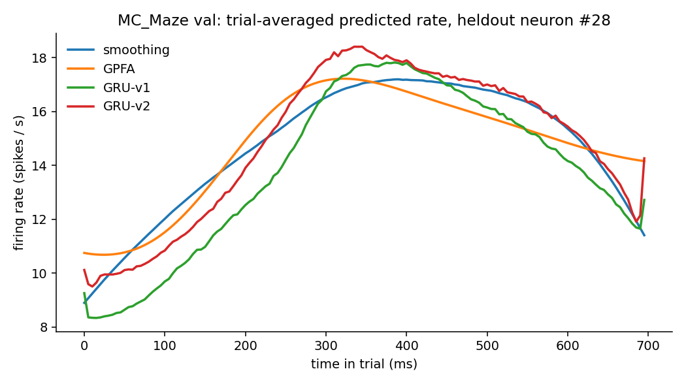

# nlb-baselines: co-smoothing on MC_Maze

Four classical models applied to the [Neural Latents Benchmark '21](https://arxiv.org/abs/2109.04463) MC_Maze co-smoothing task, evaluated on the validation split. The goal is a working end-to-end pipeline and a clean read on how qualitatively different modeling approaches compare on the same held-out neurons. **[EXTENSION.md](EXTENSION.md)** carries the same task forward to a transformer (which beats all four) and to the modern live benchmark, FALCON, with a neural foundation model (NDT3).

## Results (MC_Maze val, 5 ms bins)

| Model | co-bps | vel R² |
|---|---:|---:|
| Smoothing | 0.2122 | 0.6157 |
| GPFA (latent_dim=52) | 0.1868 | **0.6403** |
| GRU-v1 (2×128, 200 ep) | **0.2328** | 0.5741 |
| GRU-v2 (2×192, 500 ep, cosine, wd 1e-5) | 0.2235 | 0.6021 |
| **Masked transformer (v4: 6L, d=128)** | **0.3142** | **0.8235** |
| Causal (AR) transformer | 0.2712 | 0.7826 |
| Spike-token transformer (causal, K=256 learned units) | 0.2995 | 0.8470 |
| Poisson HMM (K=256, causal) | 0.2718 | 0.7627 |

**Among the four classical baselines, GRU-v1 wins the primary metric** and GPFA wins velocity decoding; GRU-v2 gets a lower training loss than v1 (val Poisson-NLL 0.0344 vs 0.0370) but a worse co-bps — lower loss doesn't translate to better held-out-neuron rate quality.

**A transformer beats all four on both metrics at once** (+35% co-bps over GRU-v1), breaking the smoothness-vs-sharpness trade-off the classical models sit on. A causal (streaming) variant costs ~14% co-bps but still tops every classical baseline. Details, a foundation-model (NDT3) comparison on the live FALCON benchmark, and reproduction commands are in **[EXTENSION.md](EXTENSION.md)**. **[TOKENS.md](TOKENS.md)** discretizes the population state into 256 learned tokens: the token model is the best causal model here, and a CE-vs-Poisson ablation shows the gain comes from the cross-entropy target rather than the discrete bottleneck (3-seed means).



## Task and dataset

**MC_Maze** ([DANDI 000128](https://dandiarchive.org/dandiset/000128)) — primary motor and dorsal premotor cortex recordings (Churchland lab) from monkey Jenkins during a delayed reaching task with virtual maze obstacles. 182 sorted units across the session; per NLB'21 split, 137 are held-in (visible at eval time) and 45 held-out.

- 1721 training trials, 574 validation trials, 140 time bins per trial at 5 ms bins (700 ms per trial).
- Behavior fields (`hand_pos`, `cursor_pos`, `eye_pos`, `muscle_vel/len`, `joint_vel/ang`, `force`) skipped at NWB load — not needed for co-smoothing.

The task, in one sentence: **given spikes from the 137 held-in neurons, predict firing rates for all 182 neurons over each trial's 140 bins.**

## Metrics

Both computed by `nlb_tools.evaluation.evaluate`.

- **co-bps** — co-smoothing bits/spike on held-out neurons. Primary NLB metric.
- **vel R²** — R² of hand velocity decoded (ridge regression) from predicted rates. Downstream sanity check that the rates preserve behaviorally-relevant structure.

The two are related but not the same. co-bps rewards accurate per-neuron rate; vel R² rewards smooth trajectories that decode cleanly.

## Models

All four go: heldin spikes → some intermediate representation → held-in and held-out firing rates.

**1. Spike smoothing (`baselines/run_smoothing_mc_maze.py`).** Convolve heldin spikes with a Gaussian kernel (σ = 50 ms), take log, fit a Poisson GLM (`sklearn.linear_model.PoissonRegressor`, α = 0.01) per held-out neuron mapping smoothed heldin log-rates → held-out spikes. Adapted from [`nlb_tools/examples/baselines/smoothing/`](https://github.com/neurallatents/nlb_tools/tree/main/examples/baselines/smoothing). No trainable representation.

**2. GPFA (`baselines/run_gpfa_mc_maze.py`).** Gaussian Process Factor Analysis via [`elephant.gpfa`](https://elephant.readthedocs.io) — probabilistic dim-reduction with linear-Gaussian latents. `latent_dim=52`, then ridge (α₁ = 0.01) from factors → held-in rates, Poisson GLM (α₂ = 0.0) from held-in rates → held-out rates. Adapted from [`nlb_tools/examples/baselines/gpfa/`](https://github.com/neurallatents/nlb_tools/tree/main/examples/baselines/gpfa).

**3. GRU-v1 (`baselines/run_gru_mc_maze.py`, `GRU_CONFIG=v1`).** Bidirectional GRU over time. spikes `(B, T=140, 137)` → BiGRU(hidden=128, layers=2, dropout=0.3) → Linear(2·128 → 182) → softplus. Adam 3e-3, batch 64, Poisson NLL against concatenated (heldin, heldout) targets on train trials, 200 epochs, val split 10% of train for best-model selection.

**4. GRU-v2 (`baselines/run_gru_mc_maze.py`, `GRU_CONFIG=v2`).** Same family, bigger + longer + regularized: BiGRU(hidden=192, layers=2, dropout=0.35), Adam 3e-3 with weight decay 1e-5, cosine LR 3e-3 → 3e-4 over 500 epochs.

## What each captures and misses

- **Smoothing** is a hard baseline. At σ = 50 ms it's already close to the trial-averaged PSTH, which captures a lot of MC_Maze's variance; the Poisson GLM is what gives it per-trial signal.
- **GPFA** wins velocity R². Linear-Gaussian latent dynamics produce smooth low-dim trajectories that decode cleanly. But it fits held-out neurons with just a linear map from those latents, and MC_Maze's held-out set includes neurons that don't fall on that manifold — hence the weakest co-bps.
- **GRU-v1** does best on co-bps because BiGRU can model neuron-specific temporal patterns non-linearly. It underperforms on vel R² — the rates are less smooth than GPFA's, which hurts a ridge-regression velocity decoder.
- **GRU-v2** shows that "more capacity + more training + regularization" isn't monotonic. Weight decay + cosine schedule pushed the model to smoother rates (better vel R² than v1) but lost the per-neuron sharpness that co-bps rewards. Converged around epoch 400; last 100 epochs of cosine wound-down burned compute for nothing.

The figure above makes the smoothness-vs-sharpness axis visible directly: GPFA is the smoothest, GRU-v1 the sharpest, smoothing and GRU-v2 in between.

## Lessons

1. **Lower training loss ≠ better co-bps.** v2's Poisson-NLL was lower but co-bps was worse. If you optimize co-bps directly rather than train NLL, the trade-off shifts.
2. **Smoothness vs sharpness is a real axis.** GPFA and GRU-v2 sit on the smooth side (better vel R²); GRU-v1 sits on the sharp side (better co-bps). A hybrid that generates smooth trajectories but keeps neuron-specific residuals could plausibly beat both.
3. **On a fixed architecture, hyperparameter tuning has diminishing returns.** Pushing co-bps meaningfully past GRU-v1's 0.2328 without changing architecture (e.g. transformer, TCN, [NDT](https://github.com/snel-repo/neural-data-transformers)) is unlikely — the loss surface is flat around v1.

## Reproducing

**Setup:**

```
conda create -n nlb python=3.10 -y && conda activate nlb
pip install -r requirements.txt
pip install git+https://github.com/neurallatents/nlb_tools.git
```

**Data:**

```
pip install dandi
dandi download https://dandiarchive.org/dandiset/000128
mkdir -p data && mv 000128 data/
# expected: data/000128/sub-Jenkins/*.nwb  (~662 MB)
```

**Run:**

```
python baselines/run_smoothing_mc_maze.py            # smoothing baseline
python baselines/run_gpfa_mc_maze.py                 # GPFA baseline
GRU_CONFIG=v1 python baselines/run_gru_mc_maze.py    # GRU-v1
GRU_CONFIG=v2 python baselines/run_gru_mc_maze.py    # GRU-v2
```

The four classical runners each write rate tensors to `outputs/mc_maze_{model}_output_val.h5` and print `nlb_tools.evaluation.evaluate` at the end.

For the transformers (see [EXTENSION.md](EXTENSION.md)):

```
python baselines/prep_tensors_mc_maze.py             # one-time: bake tensors → data/mc_maze_5ms.npz
MT_CONFIG=v4 python baselines/run_masked_transformer_mc_maze.py   # masked transformer (v1–v5)
python baselines/run_ar_transformer_mc_maze.py       # causal (AR) transformer
python eval_all_mt.py                                # score all transformer outputs
```

**~8 GB RAM required** to load the NWB — MC_Maze is not workable on a machine smaller than that (bin size doesn't help; resample runs after load).

**Figure:**

```
python make_fig_rates.py    # writes figs/rates_sample_neuron.png
```

**Runtime, wall-clock, on a 4-vCPU 16-GB Linux box:**

| Model | Fit time |
|---|---:|
| Smoothing | ~2 min |
| GPFA | ~40 min |
| GRU-v1 | ~15 min |
| GRU-v2 | ~40 min |

## Repo layout

```
baselines/          # per-model runners (classical + transformers + tokens/HMM + prep_tensors)
data/               # (gitignored) DANDI NWB downloads + baked tensor npz
outputs/            # (gitignored) rate h5s produced by each runner
figs/               # figures (committed)
make_fig_rates.py   # generate figs/rates_sample_neuron.png from outputs/*.h5
eval_all_mt.py      # score transformer / token / HMM outputs/*.h5 against MC_Maze val targets
EXTENSION.md        # transformers on MC_Maze + FALCON/NDT3 foundation-model write-up
TOKENS.md           # spike tokens + CE-vs-Poisson ablation + Poisson HMM on MC_Maze
requirements.txt
```

## Known gotchas

Encountered while building this out; documenting so the next person doesn't lose time to them.

1. **`scipy.signal.gaussian` was removed in scipy 1.11.** Use `scipy.signal.windows.gaussian`. `nlb_tools/examples/baselines/smoothing/run_smoothing.py` still uses the old name.
2. **`include_psth=True` in `make_eval_target_tensors` triggers a multiprocessing.Pool** that hits `BrokenPipeError` on cleanup with newer Python versions. Set `include_psth=False`; co-bps and vel R² are the primary metrics anyway.
3. **`elephant.gpfa` needs `numpy>=2.0` in versions ≥ 1.1**, but `nlb_tools` pins `pandas==1.3.4` which requires `numpy<2`. Fix: `pip install "elephant==1.0.0"`. That version imports `scipy.integrate.simps` (also removed in scipy 1.11), so add a shim at the top of the GPFA runner:

   ```python
   import scipy.integrate as _si
   _si.simps = _si.simpson
   ```

## Open

- ~~Transformer / TCN / NDT on the same task~~ — done: masked + causal transformers beat all four classical baselines; see [EXTENSION.md](EXTENSION.md). TCN and a from-scratch NDT remain untried.
- Same models on `mc_rtt`, `area2_bump`, `dmfc_rsg` — check whether the smoothing vs sharpness pattern is dataset-specific or general.
- co-bps-directed loss (train against held-out neurons directly) rather than Poisson NLL over all neurons.
- ~~VQ-VAE codebook + transformer over spike tokens~~ — done, see [TOKENS.md](TOKENS.md). Open from there: a continuous student distilled on the tokenizer's rates, to separate "cross-entropy on tokens" from "distillation".

## Citation

If you cite the benchmark, cite the original NLB paper:

> Pei, Ye, Zhu, Karniol-Tambour, et al. *Neural Latents Benchmark '21: Evaluating latent variable models of neural population activity.* NeurIPS 2021 Datasets and Benchmarks Track. https://arxiv.org/abs/2109.04463
